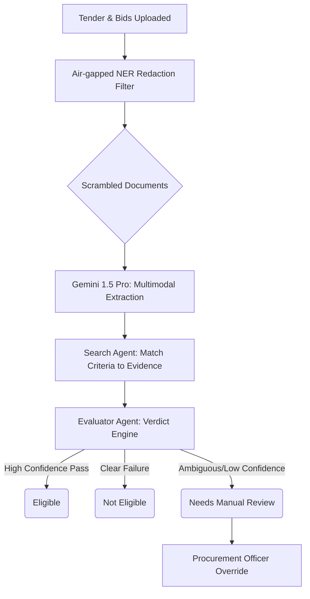

# TenderIQ: AI-Based Tender Evaluation & Eligibility Analysis

**Theme 3: AI-Based Tender Evaluation and Eligibility Analysis for Government Procurement by CRPF**

## 1. Problem Understanding & The Realities of Government Procurement

The procurement landscape for forces like the CRPF is characterized by rigorous compliance, extensive documentation, and an absolute necessity for auditability. Bidders submit packages spanning hundreds of pages—combining heavily structured PDFs, misaligned scanned photocopies, and handwritten logs. 

The core bottleneck is not merely "finding text on a page." It is:
1. **Heterogeneous Evidence**: Identical financial metrics appear as charts, tables, or scanned CA certificates depending on the bidder.
2. **Legal Nuance**: Tender clauses often contain nested conditions (e.g., "Must have ₹5CR turnover OR combined ₹6CR across subsidiaries, provided the primary firm holds ISO certification").
3. **The Danger of Silent Disqualification**: In public procurement, an algorithmic error that silently disqualifies a legitimate bid violates transparency principles and invites litigation. 

TenderIQ addresses this. We recognize that an AI solution cannot replace the procurement workflow; it must augment it. Our platform acts as a hyper-vigilant paralegal: it ingests complex documents, matches heterogeneous bidder evidence against structured criteria, and presents **explainable, immutable, citation-backed** verdicts. Any ambiguity triggers an automatic human-in-the-loop review. **Nothing is hidden; every decision is auditable.**

---

## 2. Extraction of Eligibility Criteria (Understanding the Tender)

Tender documents are deeply unstructured legal texts. Traditional NLP falters here. We utilize an expansive context window LLM architecture (e.g., Gemini 1.5 Pro) to comprehend the document holistically.

**Approach**:
1. **Document Ingestion**: The tender is processed via OCR/Layout parsing, maintaining structural integrity (headers, tables, sections).
2. **Schema-Driven Extraction**: We force the LLM to output against a strict JSON schema representing our `Criterion` data model. 
3. **Categorization & Stratification**: Through prompting, the LLM separates conditions into:
    *   `Type`: Technical, Financial, Compliance, Document.
    *   `Mandatory vs. Optional`: Recognizing "shall/must" vs. "preferred/may".
4. **Criteria Normalization**: The model reformulates dense legalese into discrete, testable logical invariants (e.g., `"clause": "3 years experience" -> "condition": "evaluation_date - incorporation_date >= 3 years"`).

---

## 3. Parsing Heterogeneous Bidder Submissions (Understanding the Bidder)

Bidder submissions are intrinsically noisy. Relying on text-layer extraction alone fails on scans or complex tables. 

**Approach: Multimodal Vision-Centric Processing**
1. **Vision-LLM Ingestion**: We bypass fragile traditional OCR pipelines. The entire submission is digested by a Multimodal Large Language Model (MLLM). Documents form a holistic image-text corpus.
2. **Targeted Value Extraction**: Rather than parsing *everything*, the system works backwards from the `Criteria` extracted in Step 2. It queries the MLLM: *"Locate the financial turnover for 2022-2023 across these 80 pages."*
3. **Bounding Box and Citation Anchoring**: Crucially, the system requires the model to return the precise `Page_Number` and `Bounding_Box` coordinates of the evidence. It does not just return "₹5.4 Crore"; it returns the visual snippet proving it.

**Data Privacy & PII Redaction Constraint**
To adhere to strict government data security policies, no raw PII is ever sent to hosted LLMs.

Prior to MLLM ingestion, all documents pass through a localized, air-gapped Named Entity Recognition (NER) filter (e.g., Presidio) that masks sensitive entities (names, bank account numbers, unredacted PAN/Aadhaar) with synthetic tokens. The Evaluator Agent operates entirely on this scrambled, structurally intact data, ensuring zero data leakage.

---

## 4. Evaluation Engine: Handling Ambiguity and Partial Information

The core matching mechanism ensures fairness and robustness against adversarial or varied language.

**Approach: Context-Aware Bipartite Matching**
1. **Evidence-Criterion Pairing**: Each discrete Criterion is matched against its corresponding extracted Evidence Object.
2. **The Evaluator Agent**: A secondary, highly restricted LLM agent acts *only* as the judge. It is fed: `The Criterion` and `The Associated Bidder Evidence`.
3. **Trinary Verdicts**: The engine determines a verdict:
    *   `Eligible` (High Confidence Match)
    *   `Not Eligible` (Clear failure to meet a strict constraint)
    *   `Needs Review` 
4. **Handling Ambiguity (The Inspection Line Analogy)**: The trinary system functions exactly like a manufacturing inspection line—components either pass (Eligible), fail (Not Eligible), or are routed to the rework station for manual inspection. If language is vague, if a scan is partially illegible, or if the confidence score of the match falls below a tunable threshold (e.g., 90%), the system immediately defaults to `Needs Review`. Emphasizing that this system is a safety net, not a bottleneck, reinforces absolute real-world deployability.

---

## 5. Explainability & The Human-in-the-Loop Pipeline

The mandate is "No silent disqualification." The human officer is always the final authority.

**Approach:**
1. **The Evaluation Workbench**: Our UI presents a bipartite view. On the left: The Criterion and the AI's tentative verdict. On the right: The exact document, scrolled to the correct page, with the evidence highlighted.
2. **Granular Explanations**: Every `Eligible` or `Not Eligible` verdict includes a natural language justification derived directly from the extracted text snippet.
3. **The "Needs Review" Queue**: Ambiguous cases are routed to a dedicated dashboard. The officer sees exactly *why* the AI halted—e.g., *"CA Signature on Turnover Certificate is illegible."* The officer can then manually override and set the final status.

---

## 6. Guaranteeing Auditability for Government Procurement

A decision made today might be challenged in court three years from now. 

**Approach:**
1. **Immutable Event Sourcing**: Every action—whether the initial LLM extraction or a human clicking "Override to Eligible"—is logged as an immutable event in the database.
2. **Snapshot Hashes**: When a tender is fully evaluated and locked, the system hashes the input documents, the extracted criteria, the bidder evidence, and the final verdicts into an immutable audit package.
3. **Consolidated Reporting**: An official, exportable PDF/Excel report is generated detailing the fate of every bidder across every criteria, explicitly indicating which decisions were AI-automated and which were human-overrides. 

---

## 7. Architecture overview & Technology Choices

**The Multi-Agent RAG Architecture**

- **Frontend**: `React (Vite) + TailwindCSS`. Delivers a responsive, highly accessible UI essential for government web environments.
- **Backend Orchestrator**: `Python (FastAPI)`. Python is the industry standard for AI integration; FastAPI provides robust, asynchronous throughput.
- **Database**: `PostgreSQL` for relational strictness (Audit Logs, Bidder relationships, Criteria logic).
- **Core AI Engine**: 
   - **Document Understanding**: `Google Gemini 1.5 Pro` (Chosen for its native multimodal capability and massive context window, perfect for 500-page bid documents).
   - **Orchestration**: `LangChain` to manage the multi-agent workflows (Extraction Agent -> Search Agent -> Evaluator Agent). 

**Why this stack?** It favors accuracy over raw speed, visual comprehension over brittle OCR string-matching, and absolute strict data schemas (Pydantic/PostgreSQL) over loose NoSQL stores.

---

## 8. Risks and Trade-offs

1. **Risk: Hallucination of Evidence.** 
   *   *Mitigation*: We mitigate this via our "Citation-Anchoring" requirement. The Evaluator Agent is prohibited from evaluating without a valid Bounding Box/Page Number reference.
2. **Risk: Scanned Document Quality.** Extremely poor photocopies. 
   *   *Mitigation*: MLLMs handle noise better than Tesseract, but if confidence is low, we hard-route to `Needs Review`. We trade off automation speed for absolute accuracy.
3. **Trade-off: Inference Cost vs. Accuracy.**
   *   We use premium models (like Gemini 1.5 Pro) for initial extraction rather than smaller local models to maximize zero-shot formatting accuracy. In production, caching and targeted routing can reduce costs.

---

## 9. Implementation Plan for Round 2 (Sandbox)

If selected for Round 2, our development pipeline will proceed as follows:
1. **Infrastructure Sandbox Setup (Days 1-2)**: Deploy the FastAPI/React stack securely via Docker configurations. Connect to mock document blob storage and mock Postgres DB.
2. **Agentic Pipeline Implementation (Days 3-5)**: Implement the LangChain flows utilizing strict Pydantic Output Parsers to guarantee deterministic schema generation from the LLM. 
3. **Multimodal Extraction Logic (Days 6-8)**: Integrate the Vision capabilities, using PyMuPDF to render bounding boxes on the frontend UI overlay corresponding to the MLLM's extraction data.
4. **Audit & UI Polish (Days 9-10)**: Lock down the Human-in-the-Loop event logging system and finalize the Evaluation Workbench UI to ensure zero friction for the end-user.
